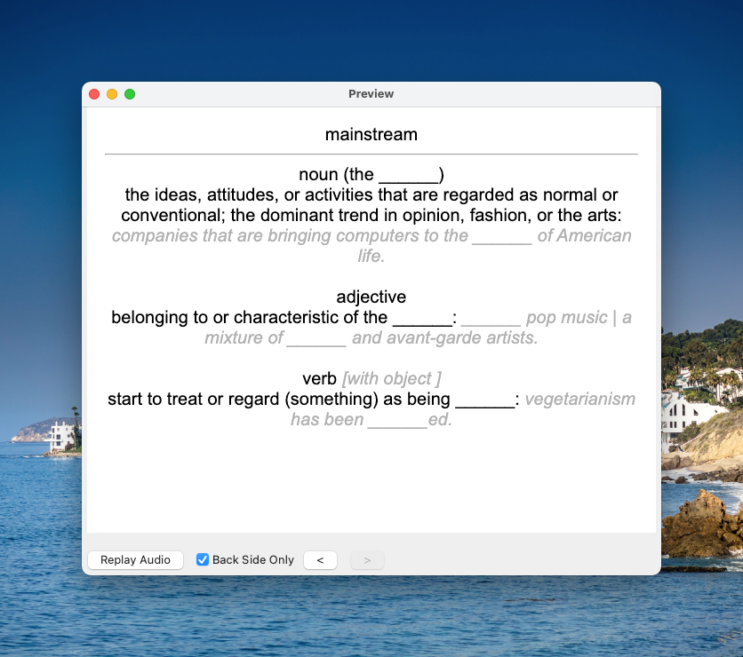
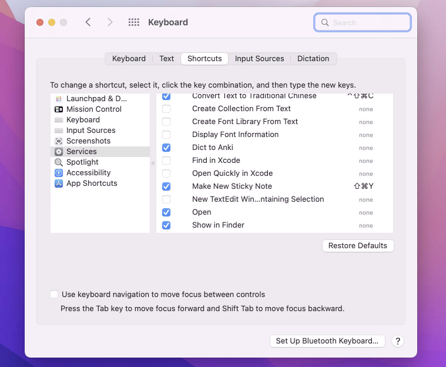

# macOS Dictionary.app retriever for Anki

The work is inspired by [Choe's Work](https://github.com/seungwoochoe/macOS-Dictionary-retriever-for-Anki).

# Usage

Step 1: Right click on the word and choose "Dict to Anki" from the menu.

Step 2: The word will be added to the Anki deck automatically.
# install

Step 1: Make sure you have installed the [Anki-connect](https://ankiweb.net/shared/info/2055492159) add-on. 

Step 2: Download the release and unzip the workflow, then double click to install. 

